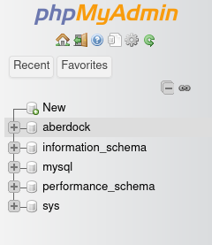
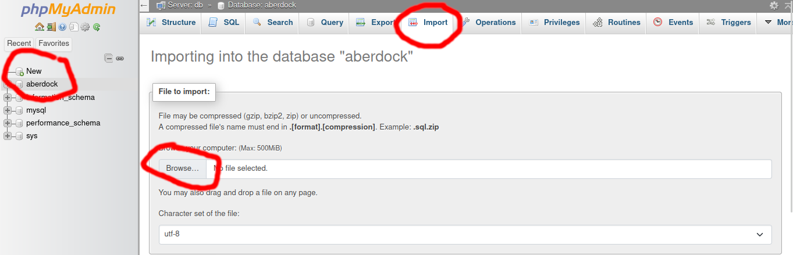
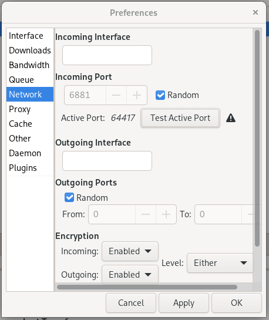
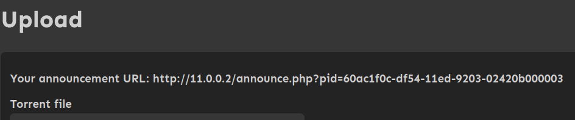
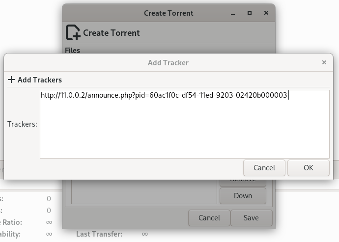
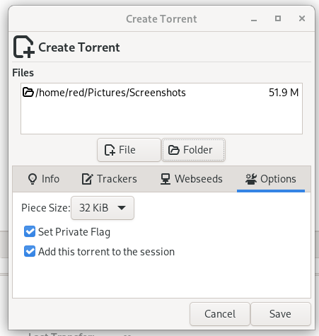
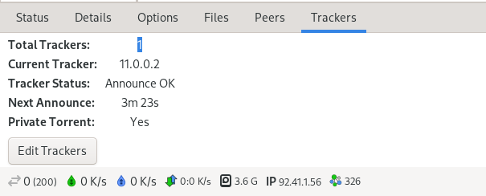

# AberDock BitTorrent Tracker Website
This is the source repository for AberDock, a BitTorrent Tracking Website that makes it easy to upload
and share content via the Bittorrent protocol.

## Getting started
In order to set up your own instance of AberDock, you need working installation of Docker and Docker Compose (2.16 is recommended).

### Installing Docker and Docker Compose
Below are instructions on how to install the necessary dependencies to run AberDock. I only have experience setting up Docker on Ubuntu and Arch-based distributions.

#### Arch Linux
Commands (requires root):

```
pacman -Sy
pacman -S docker docker-compose wget git
systemctl enable --now docker
```

#### Ubuntu/Debian
Commands (requires root):

```
apt update
apt install docker wget git
```

Ubuntu currently ships with an outdated version of docker-compose, which doesn't support the `name` alias for the stack. This means that the provided docker-compose.yml won't work as-is. To get around this, we need to obtain a copy directly from the official Docker Github releases.

Commands (requires root):

```
wget https://github.com/docker/compose/releases/download/v2.16.0/docker-compose-linux-x86_64 -O /usr/bin/docker-compose
chmod +x /usr/bin/docker-compose
```

The above commands assume that AberDock is being deployed on an X86-64 architecture. For any other architecture, replace `x86_64` with one of the following relevant options:

`aarch64`, `armv6`, `armv7`, `ppc64le`, `riscv64`.

### Deploying AberDock with Docker Compose
#### Obtaining the code
Now that Docker and Docker Compose are installed, AberDock can be deployed. First we need to clone this repository and change directory like so:

```
git clone https://github.com/jackrdavies2023/jrd15_MP_AberDock_BitTorrent_src
cd jrd15_MP_AberDock_BitTorrent_src
```

#### Customising setup parameters

Now before we deploy the instance using compose, some configuration changes may be in order.

##### Environment variables
There are two files in this repository: `aberdock.env` and `mariadb.env`. These need modifying to reflect your preferences. They contain information regarding the database, such as username, password and name of the database.

##### Compose file
The `docker-compose.yml` file may need modifying to suit your specific environment. By default, the docker-compose creates a new vLAN and volume for `mariadb`. The default configuration creates three containers: `aberdock` (11.0.0.2), `aberdock_mariadb` (11.0.0.3) and `aberdock_phpmyadmin` (11.0.0.4). Make sure the IP address for MariaDB matches the one defined in `aberdock.env`.

#### Starting the containers
Now that configuration is complete, it's time to deploy the containers. To do this, run the following commands using the root account, with the current working directory being this repository.

```
docker-compose up -d
```

This will deploy the containers and detach from them, so that they run in the background. To check if they are running, run the following command as root:

```
docker container ps | grep "aberdock"
```

#### Importing the SQL
AberDock doesn't configure the SQL automatically. This is to prevent the risk of overwriting the database in the event of an upgrade. This is why our compose file includes definitions for PHPMyAdmin, a web interface for managing MySQL/MariaDB.

By default, the provided compose file sets PHPMyAdmin up to listen on [11.0.0.4:80](http://11.0.0.4:80). This may be different depending on if you've changed this in your compose file. These instructions assume that you are able to directly access this IP address.

Log into [PHPMyAdmin](http://11.0.0.4:80) using the root credentials defined in `mariadb.env`. There will be a list of databases on the left side of the screen, like so: 



Select the "aberdock" database, then select "import" from the top row of options:



Select "Browse" and choose the "aberdock.sql" file that is provided in this repository. Then scroll to the bottom of the import page and click "Import". There is no need to change the default options presented in the interface.

### Logging into AberDock
AberDock comes with a default account that has been used during development. The credentials for this account are `testAccount` (username) and `testPassword` (password).

Assuming the defaults have not been changed in the `docker-compose.yml` file, AberDock can be accessed from [11.0.0.2:80](http://11.0.0.2:80)

Once logged in, head over to the Administration page. From here, you can configure user group permissions and system defaults.

It is important that the `Announcement URL` is changed to reflect your configuration. Without this, users will not be able to share content as they will not have a tracker to connect to! `/announce.php` MUST also be appended to the URL, unless rewrite rules are being used.

## Running behind a proxy
It is common for Docker services to be accessed via a proxy such as NGINX. This allows for hosting multiple web services on the same port.

Below is an example NGINX configuration file that can be used with AberDock, with SSL/HTTPS:

```
server {
        listen       80;
        server_name  aberdock.example.com;
        root         /www/default;

        location ~ (.well-known) {
          break;
        }

        if ($http_user_agent ~* (masscan|Go-http-client|CensysInspect)) {
            return 403;
        }

        location / {
          return 301 https://$host$request_uri;
        }
}

server {
    listen       443 ssl;
    server_name  aberdock.example.com;
    root         /www/default;

    # Max upload of 50M
    client_max_body_size 50M;
    proxy_request_buffering off;
    add_header Strict-Transport-Security "max-age=15552000; includeSubDomains" always;

    ssl_certificate            /certs/aberdock.example.com_ecc/fullchain.cer;
    ssl_certificate_key        /certs/aberdock.example.com_ecc/aberdock.example.com.key;
    ssl_session_cache          shared:SSL:100m;
    ssl_session_timeout        1d;
    ssl_ciphers                HIGH:!aNULL:!MD5:!kEDH;
    ssl_prefer_server_ciphers  on;

    fastcgi_max_temp_file_size 0;
    fastcgi_buffers 64 4K;

    location / {
        proxy_set_header  Host aberdock.example.com;
        proxy_set_header  X-Real-IP $remote_addr;
        proxy_set_header  X-Forwarded-For $remote_addr;
        proxy_set_header  X-Forwarded-Host $remote_addr;
        proxy_buffering   off;

        proxy_pass http://11.0.0.2:80;
    }

    location ~ /\.ht {
        deny  all;
    }
}

```

## FAQ
Below are some common issues that users may encounter and possible solutions to address them.

### My torrents aren't seeding to other users. Why is this?

It's possible that you haven't opened up the necessary ports for your client to be accessible from the internet. Usually this is done automatically via UPnP (Universal Plug and Play), however there are some circumstances where UPnP is disabled by default in your router configuration or UPnP isn't working properly.

If you are using Deluge as your client, you can check if these ports are being forwarded correctly by navigating to `Edit -> Preferences -> Network` and selecting `Test Active Port`

If you have an exclamation mark like below, that means that the ports have not been forwarded through your routers firewall.



In order to fix this, uncheck the `Random` checkbox and set a port number of your choosing. Port `6881` should suffice. Then navigate to your routers control panel and manually add a port forwarding policy for the corresponding port number, for both UDP and TCP.

Each router is different, so consult your router manufacturers manual for more info on how to configure port forwarding.

Once forwarded, return back to Deluge and try the `Test Active Port` option again.

## How do I create a torrent that I can submit to AberDock?

Torrents can typically be created from within your torrent client. For example, in Deluge, navigate to `File -> Create Torrent`

From there, select `File` or `Folder` and select the content you wish to share on AberDock.

Then select `Trackers -> Add`. The tracker URL you need to add is the one presented on the AberDock upload page, such as the one shown below.



Add this URL to the list of trackers. It should look similar to this:



After adding the URL, click `OK` and then navigate to `Options` and tick the options `Set Private Flag` and `Add this torrent to the session`. It should look like this:



Then click `Save` and choose where to save the .torrent file. Once the file has been generated, navigate to the AberDock upload page and select the .torrent file you just generated.

Once the file has been successfully submitted, the torrent should be authorised for use on the tracker. To ensure that the tracker has announced correctly, right click the torrent you just created in your client and select the option `Update Tracker`.

To confirm the announcement was a success, ensure the torrent you just created is selected in your client, then click the `Trackers` tab at the bottom of the interface. You should have a message saying `Announce OK` like so:



Congratulations! You just submitted your torrent!